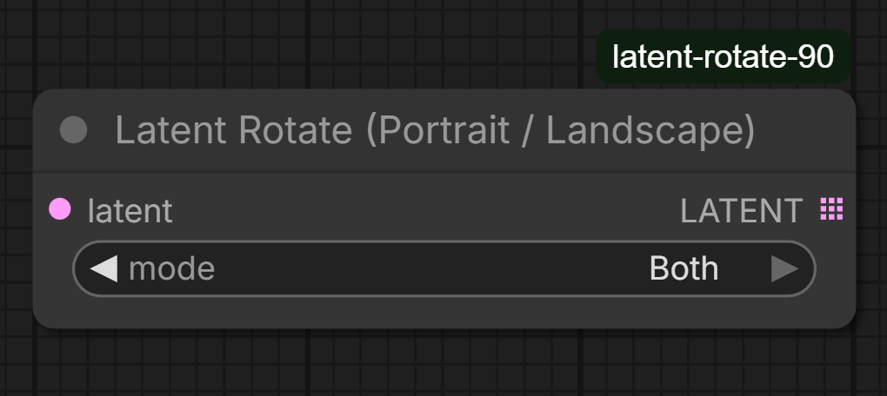

# Latent Rotate (Portrait / Landscape) — ComfyUI Custom Node

A minimal, opinionated ComfyUI custom node that emits **portrait (0°)** and/or **landscape (90°)** latent variants in a single run.

This node is designed for **deterministic orientation comparison** and **geometry-aware workflows**, without redundant rotations, filename hacks, or UI friction.

---

## Why this node exists

Diffusion models operate on a grid-aligned latent space.  
Only two rotations preserve that structure meaningfully:

- **0°** — native orientation (portrait)
- **90°** — orthogonal orientation (landscape)

Rotations of **180°** and **270°** do not add new structural information and only increase compute cost and dataset noise.  
This node intentionally excludes them.

This node was created to remove repetitive manual rotation steps in orientation-sensitive workflows.

---

## Features

- Emits **0°**, **90°**, or **both** in a single execution
- Uses **latent lists** (no queue tricks, no batch hacks)
- Deterministic output ordering
- Rotation applied **before sampling**
- Metadata passthrough (`rotation`, `orientation`)
- Compatible with all samplers, VAEs, and SaveImage
- No filename manipulation or suffix logic
- Clean, predictable graph semantics

---

## Node Inputs

### `latent`
Input latent.

### `mode`
Select which orientations to emit:

- **Portrait Only** → 0°
- **Landscape Only** → 90°
- **Both** → 0° and 90°

---

## Outputs

### `LATENT (list)`

Depending on mode:

- Portrait Only → `[latent_0deg]`
- Landscape Only → `[latent_90deg]`
- Both → `[latent_0deg, latent_90deg]`

The output is **always a list**, even when it contains a single latent.  
This is intentional and keeps downstream behavior stable.

---

## Usage

Typical wiring:

Empty Latent
↓
Latent Rotate (Portrait / Landscape)
↓
KSampler
↓
VAE Decode
↓
SaveImage

yaml
Copy code

ComfyUI automatically iterates over the latent list and generates one image per orientation.

---

## Notes on determinism

For meaningful orientation comparison:

- Use a fixed seed in the KSampler
- Keep sampler, steps, CFG, and model settings identical

The node prints a reminder in the console to reduce accidental randomness.

---

## Why filenames are not modified

This node deliberately does **not** modify filenames or emit suffixes.

Rationale:
- Orientation is visually obvious
- Filename logic is often already complex (timestamps, experiment IDs, pipelines)
- SaveImage works best as a simple sink

If filename tagging is required, it can be handled upstream using standard STRING nodes.

---

## FAQ

### Why does the output port look dotted or stacked?
The dotted icon indicates that the node outputs a **list** of latents rather than a single latent.  
This is normal behavior in ComfyUI and allows downstream nodes to process each orientation automatically.

---

### Why not support 180° or 270° rotations?
Those rotations do not introduce new compositional information for diffusion models.  
They mainly add redundant computation and clutter datasets without practical benefit.

---

### Can this node rotate by arbitrary angles like 45°?
No. Arbitrary-angle rotations break grid alignment in latent space and introduce interpolation artifacts.  
This node is intentionally limited to rotations that preserve latent structure.

---

### Does this double VRAM usage?
No. The model is loaded once.  
Latents are processed sequentially, not duplicated in memory.

---

## Design philosophy

This node follows a strict “do one thing well” approach:

- Geometry only
- No UI automation
- No implicit side effects
- No redundant options

The goal is **clarity, predictability, and composability** within larger ComfyUI graphs.

---

## Installation

Clone or copy the folder into:

ComfyUI/custom_nodes/latent-rotate-90/

yaml
Copy code

Restart ComfyUI.  
The node appears under:

latent → geometry

yaml
Copy code

---

## License

MIT

---

## Acknowledgements

This custom node was developed with assistance from **ChatGPT** for code generation, debugging, and documentation refinement.  
Final design decisions, integration, and validation were performed by the author.